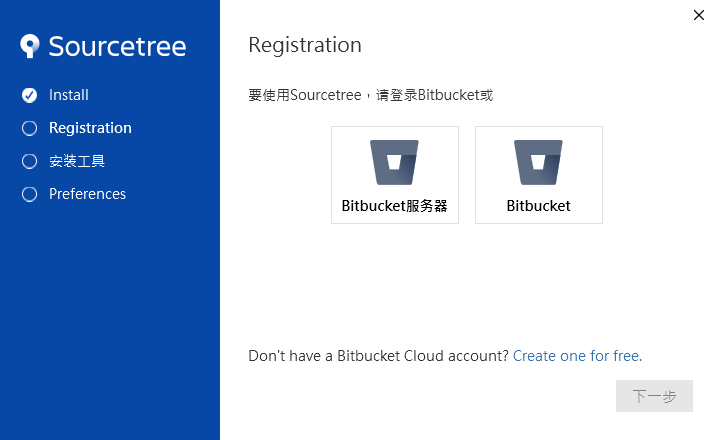
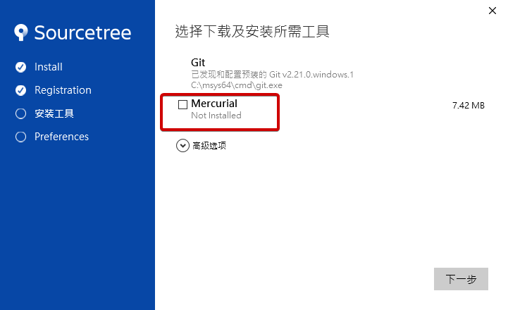

# Atlassian SourceTree Portable 

[Download the latest version](https://github.com/bluelazy/SourceTreePortable-builder/tree/master/releases) of SourceTree Portable. <== 請點此連結下載

## desc

1. 更改部分設定的預設值
2. 預設中文介面 (如果開啟程式後沒有預設顯示中文的話 請關閉程式之後 再開一次 這點目前無法解決只能透過此方法)

## Installation Prerequisites

- Windows 7 or Windows 10
- .NET Framework 4.5
- At least 360 MB of free disk space

> 如果沒有顯示中文介面請關閉程式後 再開一次

> 安裝時請記得取消 Mercurail 選項(除非你用的到這個功能)

